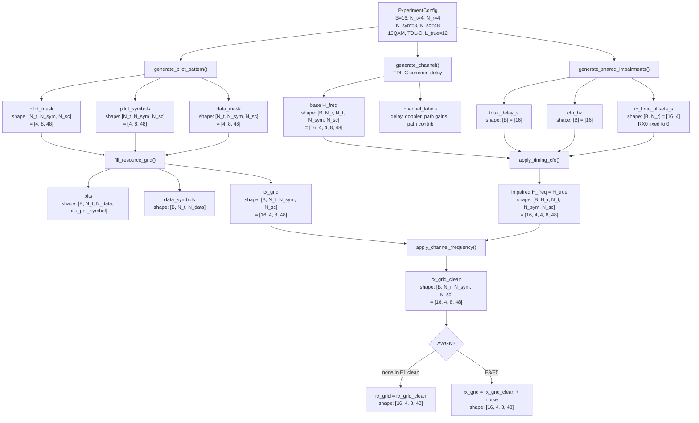
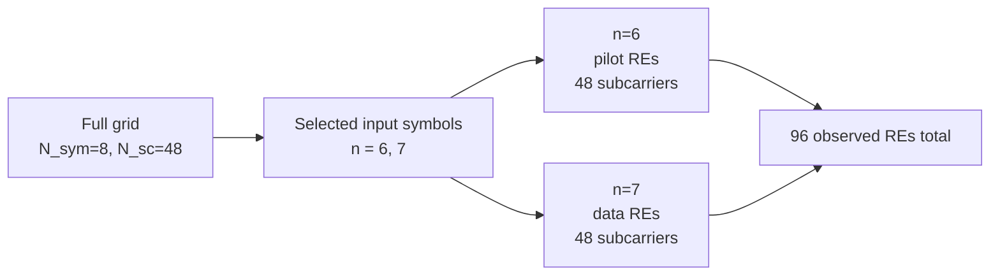
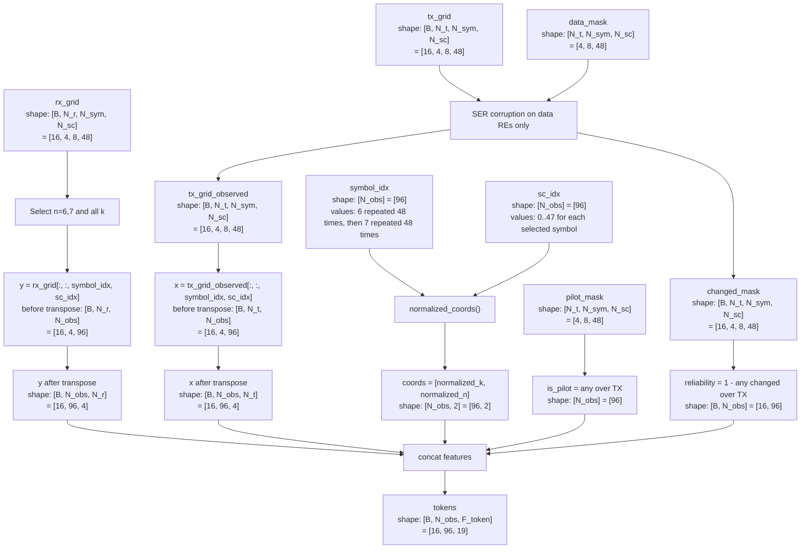

# Data Generation To Token Diagram

本文档详细说明从 TDL-C 数据生成到 Transformer input tokens 的流程，并标注当前默认维度。

## 0. 当前默认符号

| Symbol | Meaning | Current value |
|---|---|---:|
| `B` | batch size | `16` |
| `N_t` | number of TX antennas | `4` |
| `N_r` | number of RX antennas | `4` |
| `N_sym` | OFDM symbol number | `8` |
| `N_sc` | subcarrier number | `48` |
| `L_true` | true physical paths | `12` |
| `N_obs_sym` | input observed symbols | `2`, namely `n=6,7` |
| `N_obs` | observed RE count per sample | `2 * 48 = 96` |
| `F_token` | token feature dim | `19` when reliability is included |

当前 Transformer 输入 shape：

```text
tokens: [B, N_obs, F_token] = [16, 96, 19]
```

## 1. 数据生成总流程



## 2. Pilot/Data Resource Grid

当前 pilot 配置：

```yaml
pilot:
  mode: sparse2d
  symbol_spacing: 2
  subcarrier_spacing: 4
  orthogonal_axis: frequency
```

因此 pilot time symbols 是：

```text
n = 0, 2, 4, 6
```

当前输入只取：

```text
n = 6, 7
```

所以：

```text
n = 6: pilot symbol
n = 7: data-aided symbol
```



注意：`n=6` 上因为 `N_t=4` 且 TX 在 frequency 方向正交：

```text
TX0 pilot: k = 0, 4, 8, ...
TX1 pilot: k = 1, 5, 9, ...
TX2 pilot: k = 2, 6, 10, ...
TX3 pilot: k = 3, 7, 11, ...
```

四个 TX 合起来覆盖所有 `48` 个 subcarriers。因此从“任意 TX 是否有 pilot”的角度看，`n=6` 的 `is_pilot=1`。

## 3. 从 Grid 到 Observation Token



## 4. Token Feature 维度拆解

每一个 token 对应一个 observed RE，即一个 `(n,k)` 位置。

当前每个 token 的 feature 维度是：

```text
F_token = 2*N_r + 2*N_t + 2 + 1 + 1
        = 2*4 + 2*4 + 2 + 1 + 1
        = 19
```

详细如下：

| Feature block | Meaning | Shape before concat | Feature dim |
|---|---|---:|---:|
| `y.real` | RX received real part | `[B, N_obs, N_r] = [16, 96, 4]` | `4` |
| `y.imag` | RX received imag part | `[B, N_obs, N_r] = [16, 96, 4]` | `4` |
| `x.real` | TX symbol real part | `[B, N_obs, N_t] = [16, 96, 4]` | `4` |
| `x.imag` | TX symbol imag part | `[B, N_obs, N_t] = [16, 96, 4]` | `4` |
| `coords` | `[normalized_k, normalized_n]` | `[B, N_obs, 2] = [16, 96, 2]` | `2` |
| `is_pilot` | pilot/data flag | `[B, N_obs, 1] = [16, 96, 1]` | `1` |
| `reliability` | symbol-error reliability | `[B, N_obs, 1] = [16, 96, 1]` | `1` |
| **Total** |  | `[B, N_obs, 19] = [16, 96, 19]` | `19` |

所以 token 的具体排列可以理解为：

```text
token[b, obs, :] =
[
  Re(y_rx0), Re(y_rx1), Re(y_rx2), Re(y_rx3),
  Im(y_rx0), Im(y_rx1), Im(y_rx2), Im(y_rx3),
  Re(x_tx0), Re(x_tx1), Re(x_tx2), Re(x_tx3),
  Im(x_tx0), Im(x_tx1), Im(x_tx2), Im(x_tx3),
  normalized_k,
  normalized_n,
  is_pilot,
  reliability
]
```

## 5. `normalized_k` / `normalized_n`

位置归一化是线性映射到 `[-1, 1]`：

```text
normalized_k = 2 * k / (N_sc - 1) - 1
normalized_n = 2 * n / (N_sym - 1) - 1
```

当前：

```text
N_sc = 48, N_sym = 8
```

所以：

```text
normalized_k = 2 * k / 47 - 1
normalized_n = 2 * n / 7 - 1
```

输入只取 `n=6,7`，因此：

```text
n=6 -> normalized_n = 0.7142857
n=7 -> normalized_n = 1.0
```

## 6. `is_pilot` 和 `reliability`

`is_pilot`：

```text
is_pilot[n,k] = 1 if any TX has pilot at this RE
is_pilot[n,k] = 0 otherwise
```

当前输入：

```text
n=6: is_pilot = 1 for all 48 k
n=7: is_pilot = 0 for all 48 k
```

`reliability`：

```text
reliability[b,n,k] = 1 if observed x is not corrupted
reliability[b,n,k] = 0 if any TX data symbol at this RE was corrupted
```

注意：

- pilot RE 不会被 SER corruption。
- data RE 才会被 symbol error corruption。
- E1/E2 clean 中 `symbol_error_rate=0`，因此全部 `reliability=1`。
- E4/E5 中若 `SER > 0`，主要是 `n=7` 上的 data-aided RE 会出现 `reliability=0`。

## 7. Tokenizer 输出

`build_observation_tokens()` 最终返回：

| Output | Shape | Meaning |
|---|---:|---|
| `tokens` | `[B, 96, 19]` | Transformer 输入 |
| `indices` | `[96, 2]` | 每个 token 对应 `[n,k]` |
| `tx_grid_observed` | `[B, N_t, N_sym, N_sc] = [16, 4, 8, 48]` | 可能被 SER 污染后的 data-aided TX grid |
| `changed_mask` | `[B, N_t, N_sym, N_sc] = [16, 4, 8, 48]` | 哪些 data symbols 被 symbol error corruption |
| `token_feature_dim` | scalar | 当前为 `19` |

`indices` 的排列：

```text
[[6, 0], [6, 1], ..., [6, 47],
 [7, 0], [7, 1], ..., [7, 47]]
```
