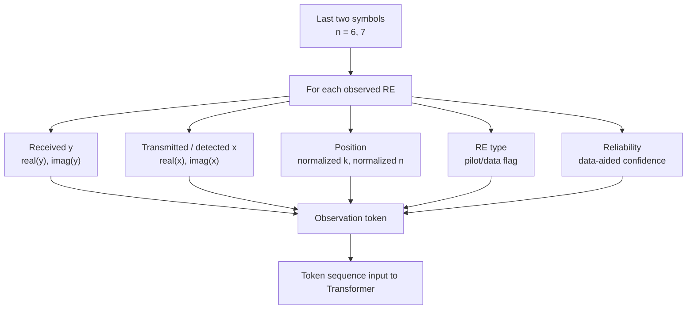
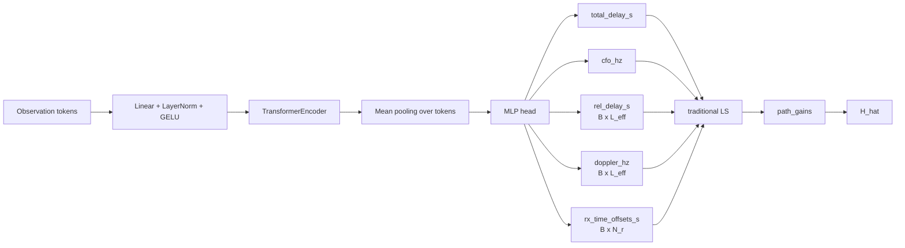
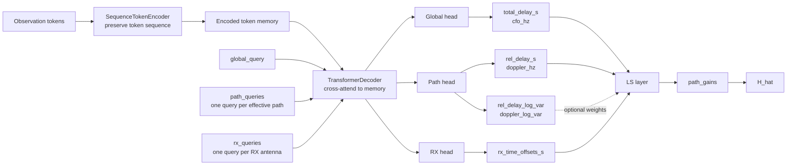
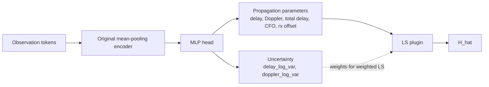
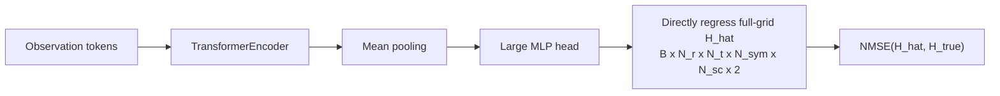
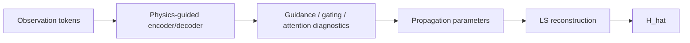
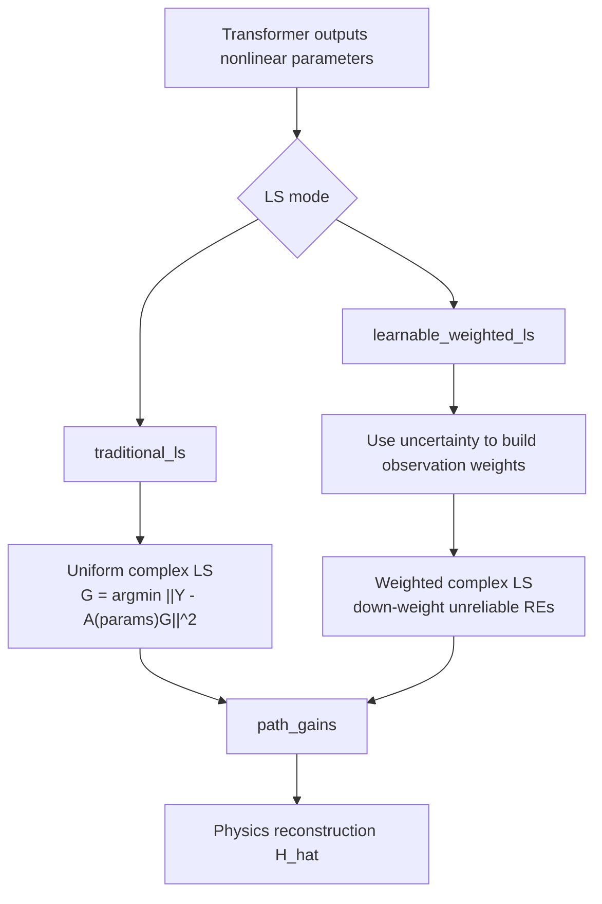
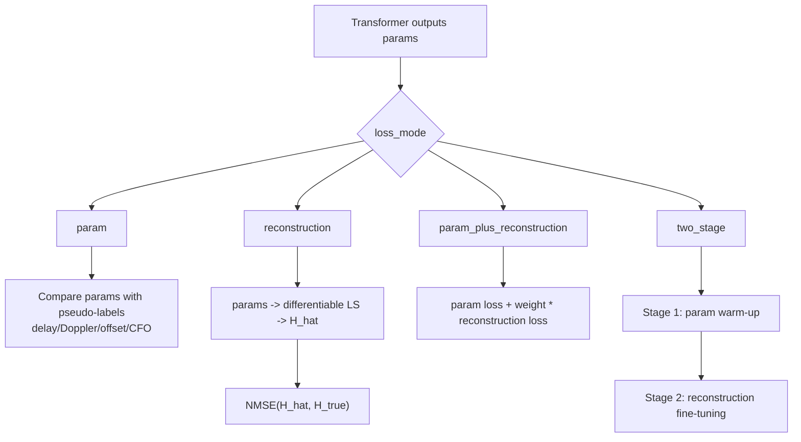
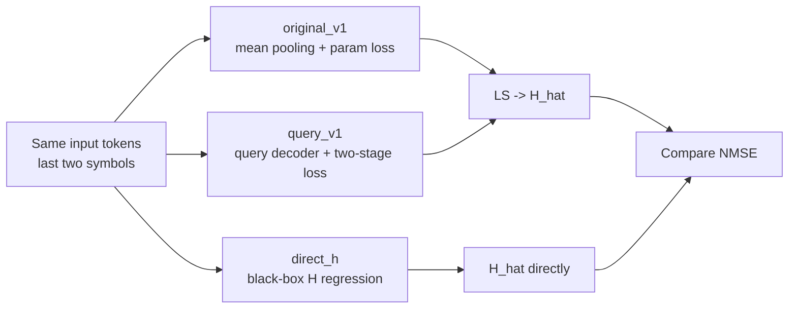

# Model Variants Diagrams

这份文档用于解释 `Thesis Transformer version1` 当前的模型变式。术语保留 English，说明使用中文。

## 1. 总体任务 Pipeline

```mermaid
flowchart LR
    A["TDL-C common-delay channel<br/>L_true = 12"] --> B["生成 full-grid H_true<br/>shape: B x N_r x N_t x N_sym x N_sc"]
    B --> C["生成 tx_grid / rx_grid<br/>16QAM + pilot/data RE"]
    C --> D["只取最后两个 OFDM symbols<br/>n = 6, 7"]
    D --> E["Observation tokens<br/>y, x, k/n position, pilot/data, reliability"]
    E --> F["Transformer variant"]
    F --> G["Nonlinear parameters<br/>delay, Doppler, total delay, CFO, rx time offset"]
    G --> H["LS layer<br/>recover path gains G_l"]
    H --> I["Physics reconstruction<br/>H_hat over all 8 symbols"]
    I --> J["Metric / loss<br/>NMSE(H_hat, H_true)"]
```



核心思想：

```text
Transformer 不直接恢复 path gains。
Transformer 估计 nonlinear propagation parameters。
LS 根据这些 parameters 恢复 linear path gains。
最后用物理公式重建完整 H_hat。
```

## 2. 输入 Token 结构



输入不是完整 `H_true`，而是最后两个时间点上的 data-aided / pilot observations。

## 3. `original_v1`: Mean-Pooling Hybrid Transformer



特点：

- 结构最简单，是当前 baseline。
- 缺点是 `mean pooling` 会压缩掉 subcarrier/time 上的 phase slope structure。
- 当前主要训练方式是 `param loss`。

## 4. `query_v1`: Query-Based Hybrid Transformer



特点：

- 不再把 token sequence 做 mean pooling。
- `global_query` 学 global parameters。
- `path_queries` 学 per-path parameters。
- `rx_queries` 学 per-RX hardware offsets。
- 可以输出 uncertainty，用于 `learnable_weighted_ls`。

## 5. `uncertainty_v1`: Mean-Pooling + Uncertainty Head



特点：

- 保留 `original_v1` 的 mean-pooling backbone。
- 额外输出 uncertainty。
- 主要用于测试 `learnable_weighted_ls` plugin。

## 6. `direct_h`: Black-Box Baseline



特点：

- 不显式估计 `delay / Doppler / CFO / time offset`。
- 不使用 LS。
- 可作为 black-box baseline。
- 缺点是物理可解释性弱，数据效率通常较差。

## 7. `epgt_v1`: Physics-Guided Transformer 分支



特点：

- 这是另一条 physics-guided exploration 分支。
- 当前论文主线可以先聚焦 `original_v1` vs `query_v1` vs `direct_h`。
- `epgt_v1` 可作为后续扩展或附录实验。

## 8. LS Plugin 变式



建议：

- 主实验先用 `traditional_ls`，因为稳定、容易解释。
- `learnable_weighted_ls` 作为 robustness / uncertainty ablation。

## 9. Training Loss 变式



当前推荐：

```text
query_v1 + two_stage + traditional_ls + reconstruction_weight = 0.05
```

## 10. 当前主线对比关系



论文叙述可以围绕这条线：

```text
1. Direct-H baseline 说明纯黑箱方法。
2. original_v1 说明 hybrid physics model 的基本有效性。
3. query_v1 + two_stage 说明保留 token structure 和 reconstruction fine-tuning 可以进一步提升精度。
```
