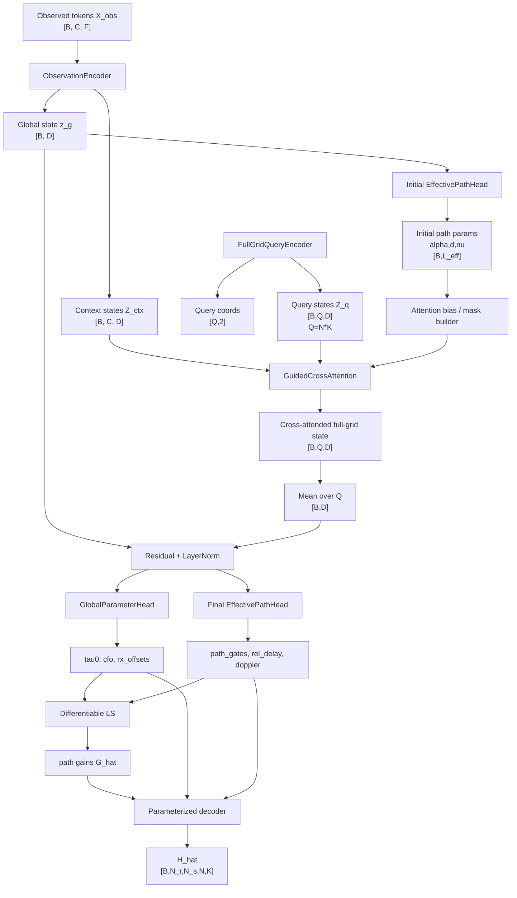
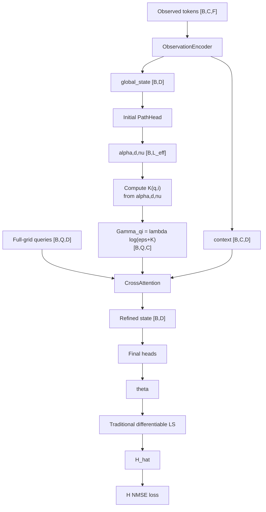
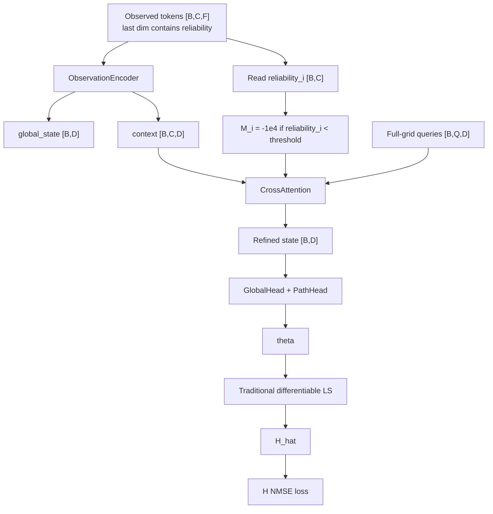
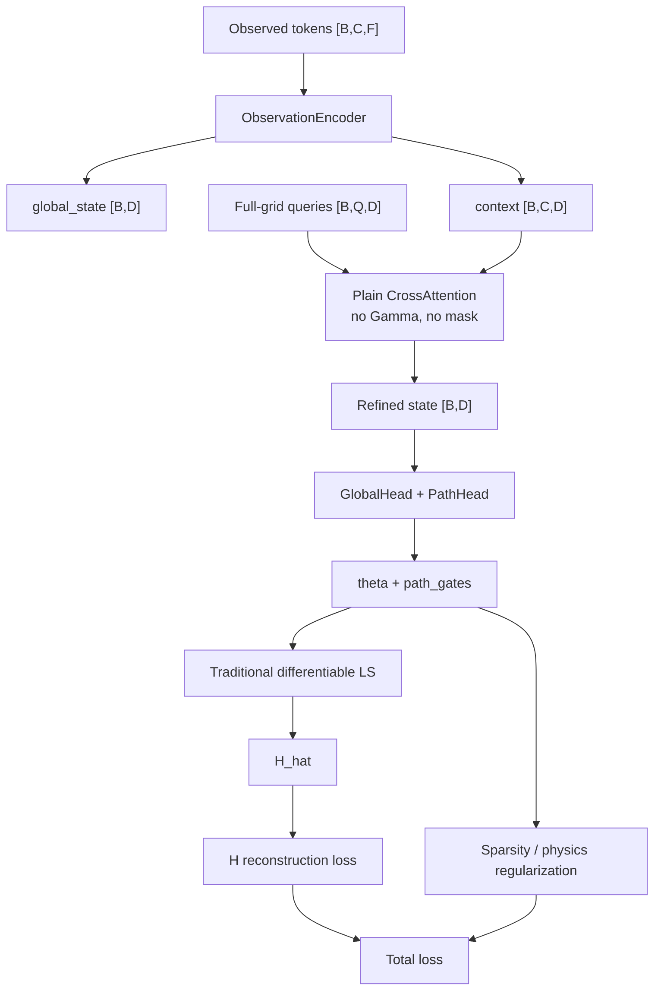
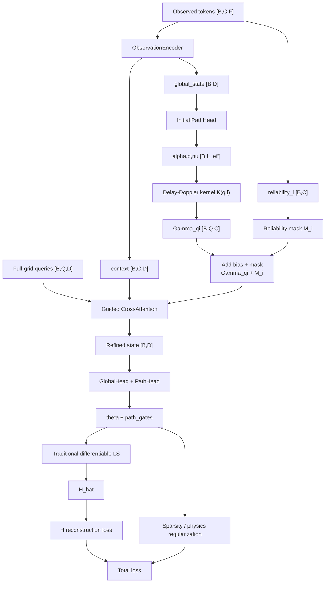
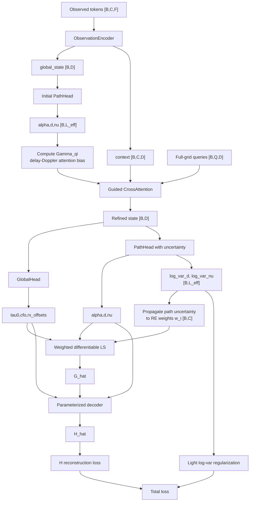
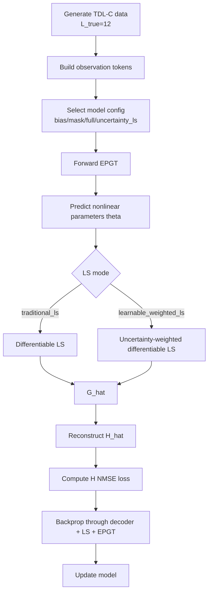

# EPGT 完整报告：物理信息引导 Transformer

## 1. 方法定位

EPGT，全称 Effective-Path Guided Transformer，是当前项目中面向 MIMO-OFDM 信道估计的物理信息引导 Transformer。它不是直接黑盒回归完整信道张量，而是采用 hybrid 结构：

```text
稀疏观测 tokens
-> EPGT 预测非线性物理参数
-> LS / weighted LS 恢复 effective path gain
-> 参数化重构 H_hat
-> 用 H reconstruction loss 训练
```

当前默认训练目标是完整信道的 H loss：

```text
L_H = ||H_hat - H_true||^2 / ||H_true||^2
```

物理参数监督只作为仿真诊断保留，不作为主训练路线。

## 2. 符号和维度

| 符号 | 含义 | 维度 |
|---|---|---|
| `B` | batch size | 标量 |
| `N_r` | receive antenna 数量 | 标量 |
| `N_s` | transmit stream / transmit antenna 数量 | 标量 |
| `N` | OFDM symbol 数量 | 标量 |
| `K` | subcarrier 数量 | 标量 |
| `C` | observed context token 数量 | `C = N_obs` |
| `Q` | full-grid query 数量 | `Q = N*K` |
| `L_eff` | effective path 数量 | 超参数 |
| `x_i` | 第 `i` 个观测 token | `[feature_dim]` |
| `H` | 完整信道张量 | `[B, N_r, N_s, N, K]` |
| `G_l` | 第 `l` 条 effective path 的空间复增益 | `[B, N_r, N_s]` |

当前 `e6_h_loss_l5.yaml` 固定：

```text
L_true = 12
L_eff = 5
```

## 3. 信道模型

EPGT 使用的 common-delay effective-path 信道模型为：

```text
H[r,s,n,k]
= exp(-j 2 pi f_k (tau0 + epsilon_r))
  * exp(j 2 pi cfo * t_n)
  * sum_{l=1}^{L_eff}
      G[l,r,s]
      exp(j 2 pi nu_l t_n)
      exp(-j 2 pi f_k d_l)
```

其中：

| 参数 | 含义 | EPGT 输出维度 |
|---|---|---|
| `tau0` | 全局 delay / common delay convention | `[B]` |
| `cfo` | 全局 carrier frequency offset | `[B]` |
| `epsilon_r` | 第 `r` 根 RX 的相对采样时间偏移 | `[B, N_r]` |
| `d_l` | 第 `l` 条 effective path 的 relative delay | `[B, L_eff]` |
| `nu_l` | 第 `l` 条 effective path 的 residual Doppler | `[B, L_eff]` |
| `alpha_l` | 第 `l` 条 effective path 的 gate / importance | `[B, L_eff]` |
| `G[l,r,s]` | 第 `l` 条 effective path 的复增益 | 由 LS 恢复 |

约束：

```text
epsilon_0 = 0
alpha_l in [0, 1]
d_l in [0, max_rel_delay_s]
nu_l in [-max_doppler_hz, max_doppler_hz]
residual Doppler 可做 gate-weighted centering
```

## 4. EPGT 公共网络结构

所有 EPGT 变体共享同一个主干 `EPGTHybridTransformer`。



### 4.1 ObservationEncoder

输入：

```text
X_obs: [B, C, F]
```

每个 token 包含：

```text
real/imag RX observation
real/imag observed TX symbols
normalized k,n coordinates
pilot indicator
optional reliability
```

处理：

```text
X_obs -> Linear(F,D) -> LayerNorm -> GELU
prepend learnable global token
TransformerEncoder
```

输出：

```text
global_state: [B, D]
context:      [B, C, D]
```

### 4.2 FullGridQueryEncoder

它为完整 OFDM 网格的每个 `(n,k)` 生成 query：

```text
query_coords: [Q,2], Q=N*K
query_state:  [B,Q,D]
```

注意：query 只覆盖时频网格 `(n,k)`，天线维度在后续参数化 LS / decoder 中处理。

### 4.3 GlobalParameterHead

从 refined global state 输出全局参数：

```text
tau0 = sigmoid(raw_tau) * max_total_delay_s
cfo  = tanh(raw_cfo) * max_cfo_hz
epsilon_r = tanh(raw_rx_r) * max_rx_time_offset_s
epsilon_0 = 0
```

维度：

```text
tau0:       [B]
cfo:        [B]
rx_offsets: [B, N_r]
```

### 4.4 EffectivePathHead

基础输出：

```text
alpha_l = sigmoid(raw_gate_l)
d_l     = sigmoid(raw_delay_l) * max_rel_delay_s
nu_l    = tanh(raw_doppler_l) * max_doppler_hz
```

维度：

```text
path_gates:  [B, L_eff]
rel_delay_s: [B, L_eff]
doppler_hz:  [B, L_eff]
```

随后按 `rel_delay_s` 排序，并同步重排 `path_gates` 和 `doppler_hz`。

如果开启 `predict_path_uncertainty`，额外输出：

```text
rel_delay_log_var: [B, L_eff]
doppler_log_var:  [B, L_eff]
```

## 5. Cross-Attention Bias 细节

EPGT 的关键是把 delay-Doppler effective-path 结构变成 cross-attention logits 中的额外项。

普通 cross-attention：

```text
Attn(q,i) = softmax(Q_q K_i^T / sqrt(D)) V_i
```

EPGT guided cross-attention：

```text
Attn(q,i)
= softmax(Q_q K_i^T / sqrt(D) + Gamma_qi + M_i) V_i
```

其中 `Gamma_qi` 是物理 attention bias，`M_i` 是可选 reliability mask。

### 5.1 从坐标得到相对时间/频率

对 query `q=(n_q,k_q)` 和 context observation `i=(n_i,k_i)`：

```text
Delta t_qi = t_{n_q} - t_{n_i}
Delta f_qi = f_{k_q} - f_{k_i}
```

### 5.2 Effective-path correlation kernel

```text
K(q,i)
= | sum_l alpha_l
      exp(j 2 pi nu_l Delta t_qi)
      exp(-j 2 pi d_l Delta f_qi) |
```

维度：

```text
K: [B, Q, C]
```

### 5.3 Attention bias

```text
Gamma_qi = bias_scale * log(bias_eps + K(q,i))
```

维度：

```text
Gamma: [B, Q, C]
```

送入 PyTorch multi-head attention 前，会扩展到 head 维：

```text
[B, Q, C] -> [B*nhead, Q, C]
```

## 6. Reliability Mask

Reliability 是 observation token 里的外部标注，不是 path uncertainty。

当前 tokenizer 生成：

```text
reliability_i = 1, 没有符号错误
reliability_i = 0, 发生符号错误
```

维度：

```text
reliability: [B, C]
```

mask：

```text
M_i = -1e4, if reliability_i < min_reliability
M_i = 0,    otherwise
```

广播到：

```text
M: [B, 1, C] -> [B, Q, C]
```

概念区分：

| 项 | 来源 | 维度 | 含义 |
|---|---|---|---|
| reliability | 数据侧 annotation | `[B,C]` | observed RE 是否可信 |
| uncertainty | 网络输出 | `[B,L_eff,2]` | path delay/Doppler 预测是否可信 |

## 7. LS 和 H-loss 训练流程

EPGT 输出非线性参数后，`G[l,r,s]` 由 LS 恢复。

### 7.1 Traditional LS

给定参数 `theta`：

```text
y = A(theta, x) g + z
```

传统 ridge LS：

```text
g_hat = (A^H A + lambda I)^(-1) A^H y
```

恢复所有 RX 后得到：

```text
G_hat: [B, L_eff, N_r, N_s]
```

然后重构：

```text
H_hat = decoder(theta, G_hat)
```

训练损失：

```text
L_H = NMSE(H_hat, H_true)
```

### 7.2 Learnable Weighted LS

weighted LS：

```text
g_hat = (A^H W A + lambda I)^(-1) A^H W y
```

其中：

```text
W = diag(w_i), i=1,...,C
```

如果模型输出 path-level uncertainty，则对观测 RE `(n_i,k_i)`：

```text
phase_var_{l,i}
= (2 pi f_{k_i})^2 sigma^2_{d,l}
  + (2 pi t_{n_i})^2 sigma^2_{nu,l}
```

聚合 path 维度：

```text
obs_var_i = mean_l phase_var_{l,i}
```

转为权重：

```text
w_i = 1 / (1 + obs_var_i / mean_i(obs_var_i))
```

实现中会：

```text
normalize weights to mean 1
clamp weights to [0.5, 2.0]
```

这可以降低极端权重导致的 LS 投机风险。

## 8. EPGT 变体总览

| 变体 | 配置文件 | Cross-Attention Bias | Reliability Mask | Sparsity/Physics Loss | Path Uncertainty Weighted LS |
|---|---|---:|---:|---:|---:|
| base | `epgt_v1_base.yaml` | 是 | 否 | 否 | 否 |
| bias_only | `epgt_v1_bias_only.yaml` | 是 | 否 | 否 | 否 |
| mask_only | `epgt_v1_mask_only.yaml` | 否 | 是 | 否 | 否 |
| loss_only | `epgt_v1_loss_only.yaml` | 否 | 否 | 是 | 否 |
| full | `epgt_v1_full.yaml` | 是 | 是 | 是 | 否 |
| uncertainty_ls | `epgt_v1_uncertainty_ls.yaml` | 是 | 否 | 可选 uncertainty regularization | 是 |

## 9. 变体一：EPGT Bias-Only

配置：

```yaml
physics:
  use_cross_attention_bias: true
  use_reliability_mask: false
```

核心思想：只使用 delay-Doppler kernel 生成 `Gamma_qi`，引导 query 从物理相干的 observed tokens 中读取信息。



适用场景：

```text
没有符号错误可靠度标签，或不想使用人工 reliability 时。
```

当前实验中它表现稳定，是推荐主线之一。

## 10. 变体二：EPGT Mask-Only

配置：

```yaml
physics:
  use_cross_attention_bias: false
  use_reliability_mask: true
  min_reliability: 0.5
```

核心思想：不加入 delay-Doppler bias，只利用 observation token 的 reliability 筛掉坏观测点。



适用场景：

```text
存在符号错误或观测污染，并且数据侧可以提供 reliability annotation。
```

注意：

```text
reliability 是人工/数据生成信息，不是网络预测 uncertainty。
```

## 11. 变体三：EPGT Loss-Only

配置：

```yaml
physics:
  use_cross_attention_bias: false
  use_reliability_mask: false
training:
  path_gate_sparsity_weight: 1.0e-3
```

核心思想：不改变 attention 读信息的方式，只在训练目标中增加轻量物理正则，例如 path gate sparsity。



当前建议：

```text
loss-only 不作为主结果优先级最高，因为它没有直接改变 cross-attention 信息聚合。
```

## 12. 变体四：EPGT Full

配置：

```yaml
physics:
  use_cross_attention_bias: true
  use_reliability_mask: true
  min_reliability: 0.75
training:
  path_gate_sparsity_weight: 1.0e-3
```

核心思想：同时使用 physical attention bias、reliability mask 和物理正则。



当前建议：

```text
Full 理论最完整，但短训练下可能不稳定。需要单独调 bias_scale、min_reliability 和 sparsity weight。
```

## 13. 变体五：EPGT Uncertainty-LS

配置：

```yaml
model:
  predict_path_uncertainty: true
physics:
  use_cross_attention_bias: true
  use_reliability_mask: false
```

核心思想：让 EPGT 自己输出 path-level uncertainty，使 `learnable_weighted_ls` 真正生效。

额外输出：

```text
rel_delay_log_var: [B, L_eff]
doppler_log_var:  [B, L_eff]
```

流程：



推荐训练命令：

```powershell
uv run --extra dev python scripts\pgt\train_pgt_h_loss.py `
  --config configs\data\e6_h_loss_l5.yaml `
  --model-config configs\model\pgt\epgt_v1_uncertainty_ls.yaml `
  --steps 200 `
  --lr 1e-3 `
  --eval-interval 20 `
  --train-batches 4 `
  --val-batches 2 `
  --ls-mode learnable_weighted_ls `
  --loss-mode reconstruction `
  --uncertainty-regularization-weight 1e-4
```

## 14. Base 配置说明

`epgt_v1_base.yaml` 是其他 YAML 的共享默认值：

```yaml
model:
  architecture: epgt_v1
  d_model: 128
  nhead: 4
  num_layers: 3
  dim_feedforward: 256
  dropout: 0.1
  max_rel_delay_s: 3.0e-6
  max_doppler_hz: 200.0
  max_total_delay_s: 1.0e-6
  max_cfo_hz: 500.0
  max_rx_time_offset_s: 200.0e-9
physics:
  use_cross_attention_bias: true
  use_reliability_mask: false
  center_residual_doppler: true
  bias_scale: 1.0
  bias_eps: 1.0e-6
  symbol_period_s: 1.0e-3
  subcarrier_spacing_hz: 15000.0
```

Base 本身等价于 bias-enabled 的 EPGT 默认版本。实验时建议显式使用 `bias_only`、`mask_only`、`full` 或 `uncertainty_ls`，避免命名歧义。

## 15. 训练流程总图



## 16. 推荐实验顺序

### 16.1 第一组：确认 EPGT 主干有效

```text
baseline_current
epgt_v1_bias_only
epgt_v1_mask_only
oracle_ls
```

评价：

```text
channel_nmse(H)
observed_symbol_nmse
```

### 16.2 第二组：确认 full 是否稳定

```text
epgt_v1_full
bias_scale in {0.25, 0.5, 1.0, 2.0}
min_reliability in {0.25, 0.5, 0.75}
```

### 16.3 第三组：确认 uncertainty weighted LS 是否有价值

```text
epgt_v1_bias_only + traditional_ls
epgt_v1_uncertainty_ls + learnable_weighted_ls
```

sweep：

```text
uncertainty_regularization_weight in {0, 1e-5, 1e-4, 1e-3}
```

## 17. 当前实现文件索引

| 功能 | 文件 |
|---|---|
| EPGT 主模型 | `src/thesis_transformer_v1/models/pgt/hybrid.py` |
| Observation / Query Encoder | `src/thesis_transformer_v1/models/pgt/encoder.py` |
| Global / Effective Path Head | `src/thesis_transformer_v1/models/pgt/heads.py` |
| Guided Cross-Attention | `src/thesis_transformer_v1/models/pgt/attention.py` |
| Delay-Doppler Attention Bias | `src/thesis_transformer_v1/physics/attention_bias.py` |
| Reliability Mask | `src/thesis_transformer_v1/physics/masks.py` |
| Differentiable LS | `src/thesis_transformer_v1/estimation/differentiable_ls.py` |
| Weighted LS Plugin | `src/thesis_transformer_v1/estimation/ls_plugins.py` |
| H-loss Training | `src/thesis_transformer_v1/experiments/training.py` |
| EPGT H-loss Script | `scripts/pgt/train_pgt_h_loss.py` |
| E6 Comparison Script | `scripts/pgt/run_e6_pgt_comparison.py` |

## 18. 总结

EPGT 的核心贡献不是简单增加一个 Transformer，而是把通信信道中的 effective-path delay-Doppler 结构显式注入到 cross-attention 中：

```text
普通 attention:
  QK^T / sqrt(D)

EPGT attention:
  QK^T / sqrt(D) + Gamma_delay_doppler + M_reliability
```

同时，EPGT 保持 hybrid 物理重构路径：

```text
预测物理参数 -> LS 恢复 path gains -> 显式重构 H
```

因此它兼具：

```text
可解释参数输出
物理引导的信息聚合
H-loss 端到端训练
与 traditional / weighted LS 的兼容性
```

当前最推荐作为主结果的版本是：

```text
epgt_v1_bias_only
epgt_v1_mask_only
```

当前最值得继续调参的扩展版本是：

```text
epgt_v1_uncertainty_ls
```

