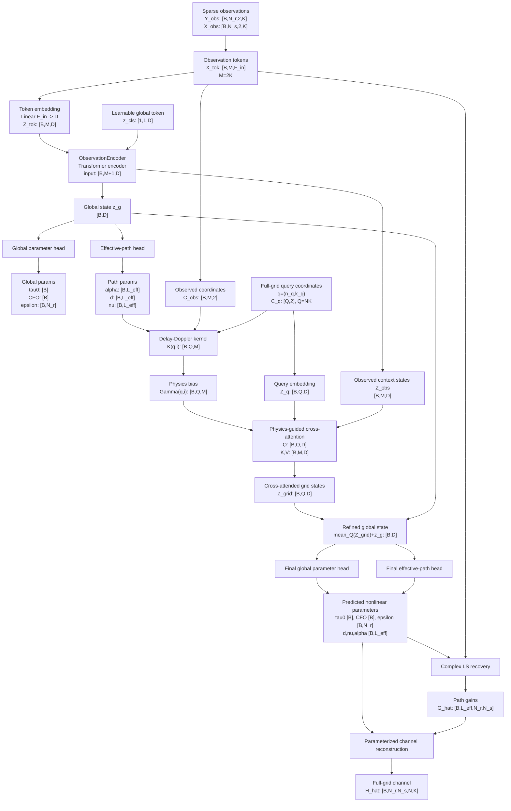
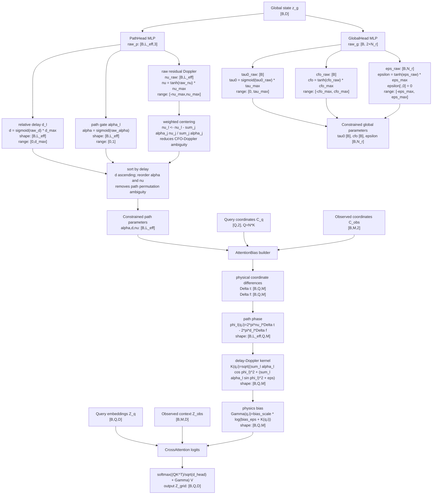
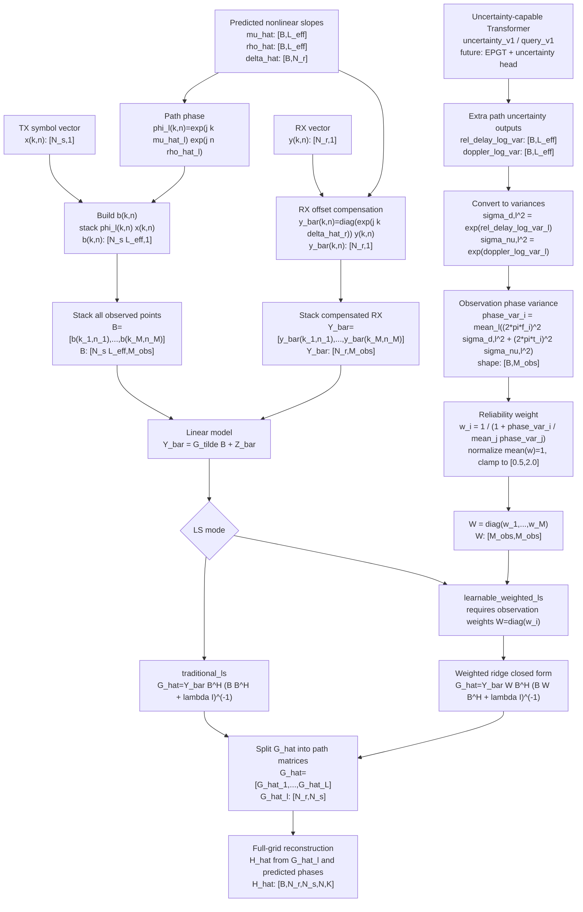
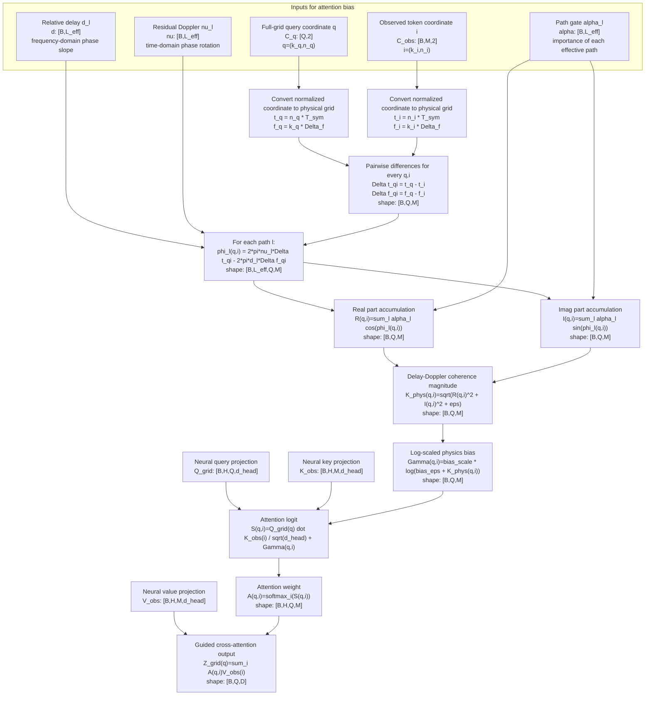
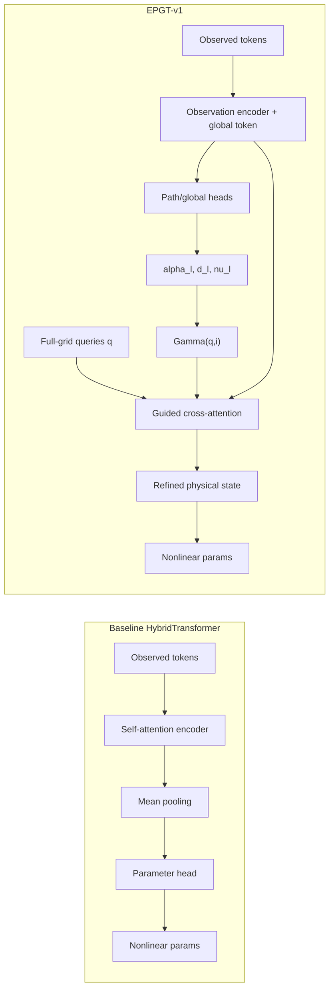

# EPGT-v1 网络架构图

EPGT-v1 的核心思想是：先从稀疏观测中预测 effective-path 物理参数，再用这些参数构造
physics-guided cross-attention bias，让 full-grid query 有选择地读取 observed tokens。

## 总体流程

记号约定：

```text
B       batch size
N       OFDM symbol / time index 数量
K       subcarrier / frequency index 数量
N_r     receive antenna 数量
N_s     transmit antenna 数量
L_eff   effective path 数量
M       observed token 数量，当前 M = |{6,7}| * K = 2K
Q       full-grid query 数量，Q = N * K
D       Transformer embedding dimension
H       attention head 数量
F_in    token feature dimension = 2N_r + 2N_s + 2 + 1 + 1
```

其中 `2N_r` 来自 received signal 的 real/imag，`2N_s` 来自 transmitted
symbol 的 real/imag，`2` 是 normalized `(k,n)` 坐标，最后两个 `1` 分别是
pilot/data flag 和 reliability flag。



## 细化模块图

下面这张图把 EPGT-v1 里最关键的几个模块展开：`GlobalHead` 的输出范围、
`PathHead` 的 effective-path 约束，以及 `AttentionBias` 如何从 predicted path
parameters 变成 cross-attention logits 里的物理偏置。



默认范围来自 `TransformerConfig`：

```text
tau_max = max_total_delay_s
cfo_max = max_cfo_hz
eps_max = max_rx_time_offset_s
d_max   = max_rel_delay_s
nu_max  = max_doppler_hz
```

当前默认值为：

```text
tau_max = 1.0e-6 s
cfo_max = 5.0e2 Hz
eps_max = 2.0e-7 s
d_max   = 3.0e-6 s
nu_max  = 2.0e2 Hz
```

## 输入 token

每个 observed resource element 形成一个 token：

```text
x_i =
[
  Re/Im y_r(n_i,k_i),
  Re/Im x_t(n_i,k_i),
  normalized k_i,
  normalized n_i,
  pilot_or_data_flag,
  reliability_i
]
```

张量维度为：

```text
X_tok: [B, M, F_in]
F_in = 2N_r + 2N_s + 2 + 1 + 1
M = 2K  # 当前使用 n=6,7 两个 OFDM symbols
```

当前 v1 中输入只来自：

```text
n_i in {6, 7}
```

但输出要重构完整：

```text
n = 0,...,7
k = 0,...,47
```

## 参数化信道模型

EPGT-v1 仍然使用 hybrid 物理重构形式：

```text
H[r,t,n,k] =
  exp(-j 2 pi f_k (tau0 + epsilon_r))
  * exp(j 2 pi cfo * t_n)
  * sum_l G[l,r,t]
      exp(j 2 pi nu_l t_n)
      exp(-j 2 pi f_k d_l)
```

网络预测 nonlinear parameters：

```text
tau0:      [B]
cfo:       [B]
epsilon:   [B, N_r], with epsilon[:,0] = 0
alpha:     [B, L_eff]
d:         [B, L_eff]
nu:        [B, L_eff]
```

其中 `G[l,r,t]` 不由网络直接输出，而是通过 LS recovery 求解：

```text
G_hat: [B, L_eff, N_r, N_s]
H_hat: [B, N_r, N_s, N, K]
```

## LS Recovery

EPGT-v1 不直接让网络输出完整的复增益矩阵。网络先预测非线性物理参数，
然后在这些参数固定后，用 LS 解析求解 effective path gain matrices。按照你图里的
符号，可以写成：

```text
given:
  mu_hat_l      effective path frequency phase slope
  rho_hat_l     effective path time phase slope
  delta_hat_r   RX antenna sampling-offset phase slope

unknown:
  G_tilde_l     effective path gain matrix
```

其中 `l=1,...,L_tilde`，`L_tilde` 就是本文实现里的 `L_eff`。每条 effective path
有一个空间增益矩阵：

```text
G_tilde_l in C^{N_r x N_s}
```

把所有 path 的增益矩阵按列块拼起来：

```text
G_tilde =
[G_tilde_1, G_tilde_2, ..., G_tilde_{L_tilde}]
in C^{N_r x (N_s L_tilde)}
```

对一个时频点 `(k,n)`，发送符号向量为：

```text
x(k,n) in C^{N_s x 1}
```

构造 path dictionary 向量：

```text
b(k,n) =
[
  exp(j k mu_hat_1) exp(j n rho_hat_1) x(k,n)
  ...
  exp(j k mu_hat_{L_tilde}) exp(j n rho_hat_{L_tilde}) x(k,n)
]
in C^{(N_s L_tilde) x 1}
```

也就是：

```text
b(k,n) =
[
  phi_1(k,n) x(k,n)
  ...
  phi_{L_tilde}(k,n) x(k,n)
]

phi_l(k,n) =
exp(j k mu_hat_l) exp(j n rho_hat_l)
```

接收信号先用估计的 RX offset 做补偿：

```text
y_bar(k,n) =
diag(
  exp(j k delta_hat_1),
  ...,
  exp(j k delta_hat_{N_r})
) y(k,n)
```

补偿后模型变成：

```text
y_bar(k,n) =
G_tilde b(k,n) + z_bar(k,n)
```

这里：

```text
y_bar(k,n) in C^{N_r x 1}
G_tilde    in C^{N_r x (N_s L_tilde)}
b(k,n)    in C^{(N_s L_tilde) x 1}
```

把所有观测时频点堆起来。若使用 full grid，则一共有 `K*N` 个点；若只用观测集合
`Omega`，则一共有 `M=|Omega|` 个点。统一记为 `M_obs`：

```text
Y_bar =
[
  y_bar(k_1,n_1), ..., y_bar(k_{M_obs},n_{M_obs})
]
in C^{N_r x M_obs}

B =
[
  b(k_1,n_1), ..., b(k_{M_obs},n_{M_obs})
]
in C^{(N_s L_tilde) x M_obs}
```

于是得到矩阵形式：

```text
Y_bar = G_tilde B + Z_bar
```

这时未知量只剩 `G_tilde`，所以可以直接用右乘形式的 LS：

```text
G_hat =
argmin_G ||Y_bar - G B||_F^2
```

如果 `B B^H` 可逆，闭式解为：

```text
G_hat =
Y_bar B^H (B B^H)^{-1}
```

如果加 ridge regularization，则是：

```text
G_hat =
Y_bar B^H (B B^H + lambda I)^{-1}
```

对应到代码里，`G_hat` 再 reshape 回：

```text
G_hat_l: [N_r,N_s], l=1,...,L_tilde
G_hat:   [L_tilde,N_r,N_s]
```

带 batch 后：

```text
G_hat: [B,L_eff,N_r,N_s]
```

按照这个符号，LS 的细化流程如下：



两种 LS 的区别可以概括为：

```text
traditional_ls
  所有观测点权重相同。
  适合干净数据，或者没有可靠 uncertainty/reliability 输出时使用。

learnable_weighted_ls
  每个观测点有权重 w_i。
  不确定性更大的观测点权重更低。
  在噪声、符号错误或观测质量不均匀时更合理。
```

当前实现里，`W` 不是网络直接输出的矩阵，而是由 uncertainty-capable Transformer 的
额外输出推导出来：

```text
uncertainty_v1 / query_v1 output:
  rel_delay_log_var_l
  doppler_log_var_l

sigma^2_{d,l}  = exp(rel_delay_log_var_l)
sigma^2_{nu,l} = exp(doppler_log_var_l)
```

对每个观测点 `i=(k_i,n_i)`，先估计相位不确定性：

```text
phase_var_i =
mean_l [
  (2*pi*f_{k_i})^2 * sigma^2_{d,l}
  +
  (2*pi*t_{n_i})^2 * sigma^2_{nu,l}
]
```

再把相位不确定性转成 LS 权重：

```text
w_i =
1 / (1 + phase_var_i / mean_j phase_var_j)

w_i <- w_i / mean_j w_j
w_i <- clamp(w_i, 0.5, 2.0)
W = diag(w_1,...,w_M)
```

所以 `W` 的学习链路是：

```text
Transformer uncertainty head
-> rel_delay_log_var, doppler_log_var
-> phase_var_i
-> w_i
-> W
-> weighted LS
-> H_hat
-> H-loss / uncertainty loss
```

注意，EPGT-v1 当前的 `alpha_l` 是 effective-path gate，主要用于
physics-guided attention bias；它不是 weighted LS 里的 `w_i`。如果后续给 EPGT
也加上 `rel_delay_log_var_l, doppler_log_var_l` 输出，那么 EPGT 就可以同时支持
physics-guided attention 和 learnable weighted LS。

训练和评估里还有一个实现层面的区别：

```text
training:
  使用 differentiable LS / torch.linalg.lstsq。
  H-loss 可以通过 LS 层反传到 mu,rho,delta，也就是代码里的 d,nu,epsilon 等参数。

evaluation:
  可以使用 traditional_ls 的 NumPy 版本，或通过 ls_plugin 选择
  traditional_ls / learnable_weighted_ls。
```

和当前代码变量的对应关系是：

```text
mu_l     <->  frequency phase slope induced by rel_delay_s d_l
rho_l    <->  time phase slope induced by doppler_hz nu_l
delta_r  <->  RX offset phase slope induced by rx_time_offsets_s epsilon_r

若使用 f_k = k * Delta_f, t_n = n * T_sym，则近似有：

mu_l    = -2*pi*Delta_f*d_l
rho_l   =  2*pi*T_sym*nu_l
delta_r =  2*pi*Delta_f*epsilon_r
```

## Physics-Guided Cross-Attention

普通 cross-attention 的 logit 是：

```text
score_neural(q,i) = Q_q K_i^T / sqrt(d)
```

EPGT-v1 加入物理 bias：

```text
score(q,i) =
  Q_q K_i^T / sqrt(d)
  + Gamma(q,i)
```

其中：

```text
Gamma(q,i) = lambda_gamma * log(eps + K(q,i))
```

`K(q,i)` 是由 predicted effective paths 定义的 delay-Doppler 相干核：

```text
K(q,i) =
| sum_l alpha_l
    exp(j 2 pi nu_l Delta t_qi)
    exp(-j 2 pi d_l Delta f_qi)
|
```

相对时频差定义为：

```text
Delta t_qi = t_nq - t_ni
Delta f_qi = f_kq - f_ki
```

更完整的 `Gamma` 求解流程如下。这里的 attention 是
`query-to-observation cross-attention`，不是 autoregressive 语言模型里的 causal
self-attention；物理 bias 是直接加在 cross-attention logits 上。



等价地，`K_phys(q,i)` 可以从复数形式拆成实部和虚部：

```text
z_l(q,i) =
  alpha_l
  exp(j 2*pi*nu_l*Delta t_qi)
  exp(-j 2*pi*d_l*Delta f_qi)

phi_l(q,i) =
  2*pi*nu_l*Delta t_qi
  - 2*pi*d_l*Delta f_qi

R(q,i) = sum_l alpha_l cos(phi_l(q,i))
I(q,i) = sum_l alpha_l sin(phi_l(q,i))

K_phys(q,i) = sqrt(R(q,i)^2 + I(q,i)^2 + eps)
Gamma(q,i) = bias_scale * log(bias_eps + K_phys(q,i))
```

这个过程里三个 path-head 输出的作用分别是：

```text
alpha_l  控制第 l 条 effective path 的权重，决定它对 K_phys 的贡献大小。
d_l      控制频率差 Delta f 上的相位变化，决定频域相关性。
nu_l     控制时间差 Delta t 上的相位变化，决定时域相关性。
```

对应张量维度：

```text
query coordinates:      C_q    [Q,2], Q=N*K
observed coordinates:   C_obs  [B,M,2]
path gates:             alpha  [B,L_eff]
relative delays:        d      [B,L_eff]
residual Dopplers:      nu     [B,L_eff]
kernel:                 K      [B,Q,M]
attention bias:         Gamma  [B,Q,M]
cross-attention output: Z_grid [B,Q,D]
```

最终 cross-attention 为：

```text
Attn(q, obs) =
softmax(
  Q_q K_obs^T / sqrt(d)
  + Gamma(q, obs)
) V_obs
```

## 和 baseline HybridTransformer 的关键区别



Baseline 的核心是：

```text
observed-token self-attention -> mean pooling -> parameters
```

EPGT-v1 的核心是：

```text
predicted effective paths -> Gamma(q,i) -> full-grid query cross-attention -> parameters
```

因此，EPGT-v1 不只是更深的 Transformer，而是把 MIMO-OFDM 的 delay-Doppler
相干结构显式注入 attention。
