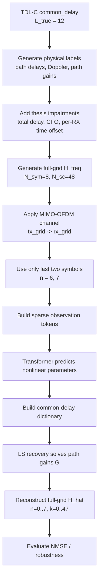
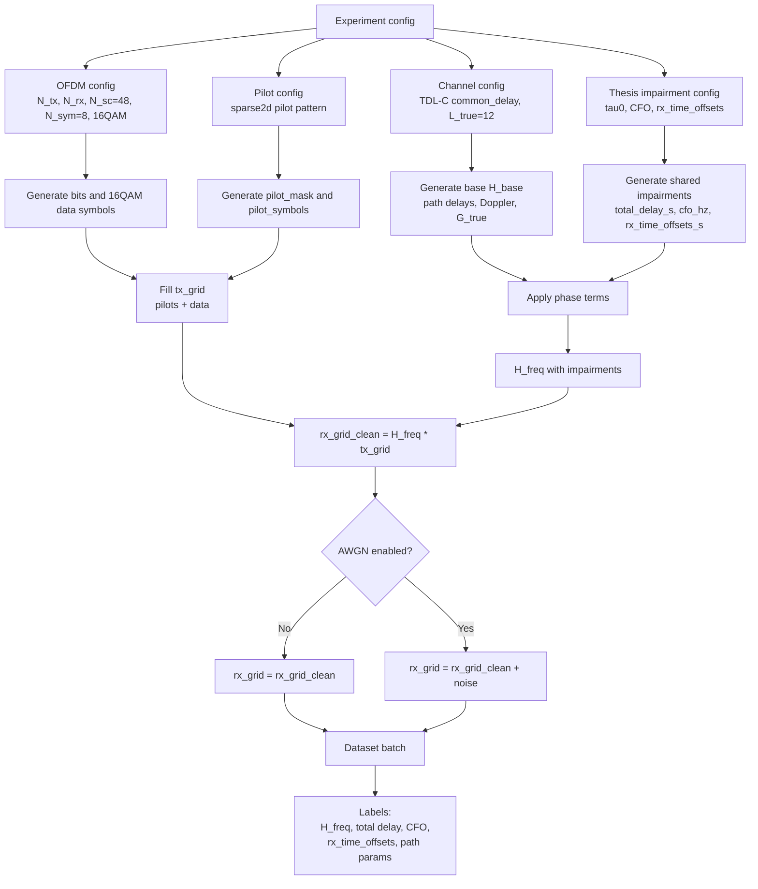
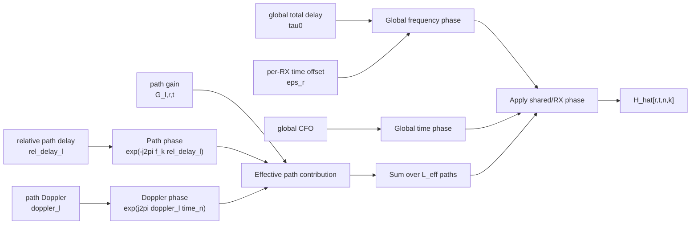
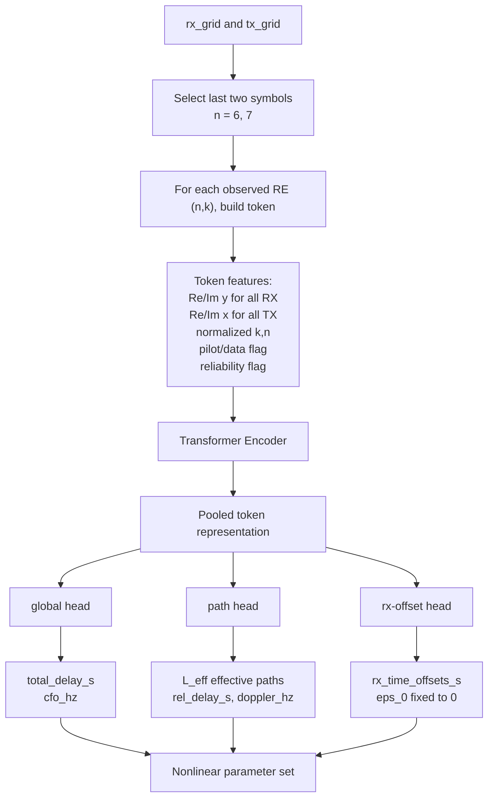
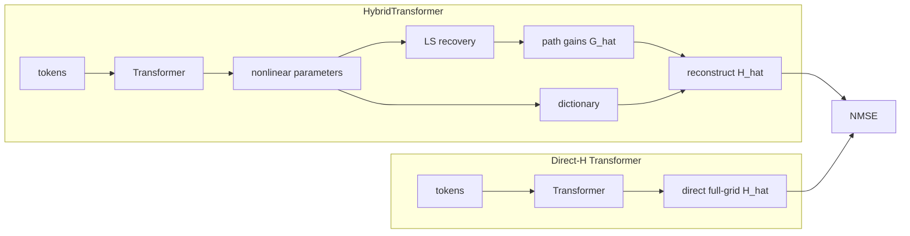
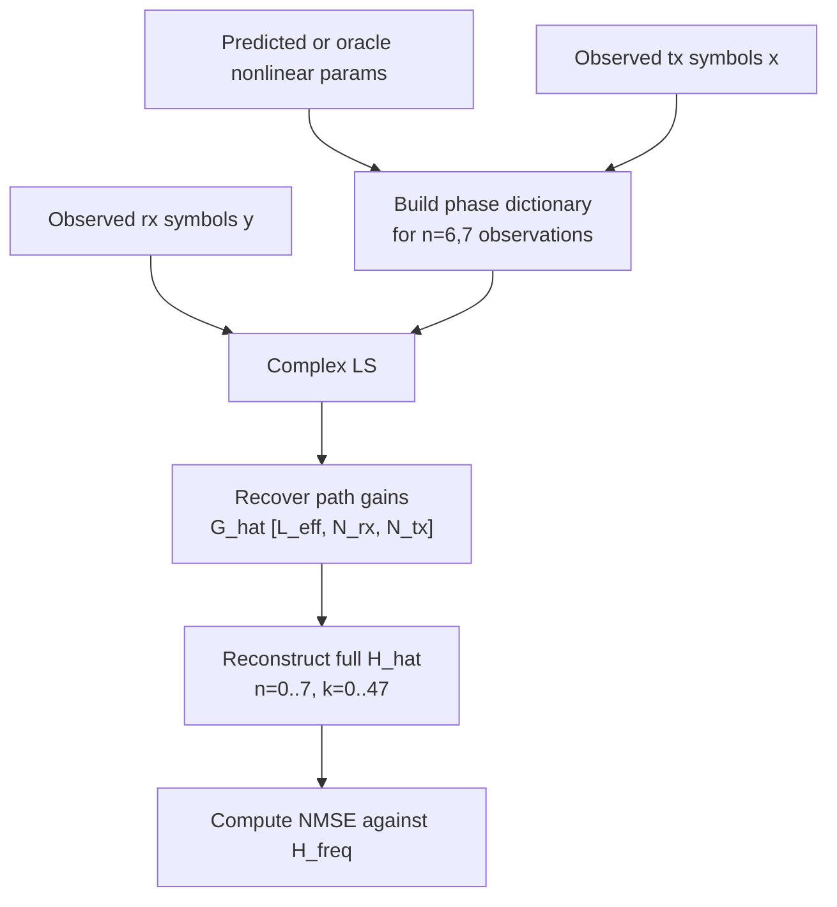
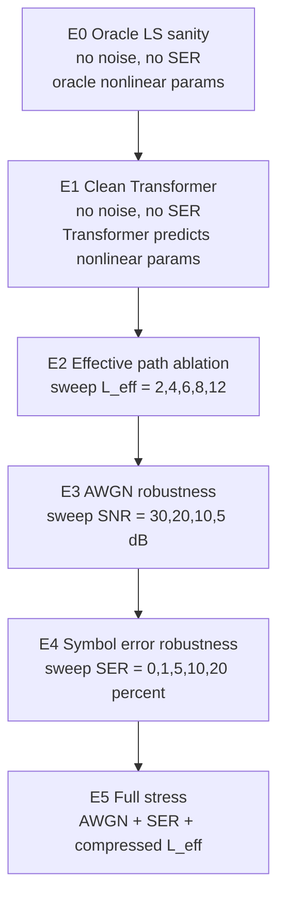

# Thesis Transformer v1 可视化说明

本文档用中文说明整体流程，关键术语保留 English，方便向导师介绍。

## 1. 当前代码里的 Loss 是什么

当前实现里有三类量：

- `training loss`: 用来训练 neural network。
- `LS recovery`: 给定 nonlinear parameters 后，用 closed-form / least-squares 求 linear path gains。
- `evaluation metrics`: 用来评价最终 channel reconstruction，例如 `NMSE`。

### HybridTransformer 的 loss

`HybridTransformer` 当前使用的是 supervised nonlinear-parameter loss。也就是说，网络只学习预测：

- `total_delay_s`
- `cfo_hz`
- `rel_delay_s`
- `doppler_hz`
- `rx_time_offsets_s`

代码中对每一类参数先做 normalization，再计算 `MSE`，最后求和：

```text
hybrid_loss =
  MSE(pred_total_delay / max_total_delay, target_total_delay / max_total_delay)
  + MSE(pred_cfo / max_cfo, target_cfo / max_cfo)
  + MSE(pred_rel_delay / max_rel_delay, target_rel_delay / max_rel_delay)
  + MSE(pred_doppler / max_doppler, target_doppler / max_doppler)
  + MSE(pred_rx_time_offset / max_rx_time_offset, target_rx_time_offset / max_rx_time_offset)
```

注意：当前最小训练脚本还没有把 `LS recovery -> H_hat -> NMSE` 放进 training loss。  
目前 `LS recovery` 和 `NMSE` 主要用于 E0 sanity check 和 evaluation。

### Direct-H baseline 的 loss

`DirectHTransformer` 当前直接回归完整 full-grid channel：

```text
target = [Re(H_freq), Im(H_freq)]
direct_h_loss = MSE(pred_H_ri, target_H_ri)
```

它是 black-box baseline，不显式预测 physical parameters，也不做 LS。

### E0 的 metric

E0 不训练网络，所以没有 neural-network loss。E0 用 oracle nonlinear parameters，做 `LS recovery`，然后评价：

```text
channel_nmse_db = 10 log10( ||H_hat - H||^2 / ||H||^2 )
```

## 2. 总体研究闭环



## 3. Data Generation 流程



## 4. Signal Model 结构图



对应公式：

```text
H[r,t,n,k] =
  exp(-j 2 pi f_k (tau0 + eps_r))
  * exp(j 2 pi cfo * time_n)
  * sum_l G[l,r,t] exp(j 2 pi doppler_l * time_n) exp(-j 2 pi f_k rel_delay_l)
```

## 5. Transformer 输入输出



## 6. Hybrid Estimator vs Direct-H Baseline



核心区别：

- `HybridTransformer`: NN 只估计 nonlinear parameters，linear gains 由 `LS recovery` 求解。
- `Direct-H Transformer`: NN 直接回归完整 `H_freq`，更黑盒。

## 7. LS Recovery 流程



LS 求解形式：

```text
y_observed = A(theta, tau0, cfo, eps_r, x_observed) g + noise
```

其中：

- `theta = {rel_delay_l, doppler_l}`
- `tau0 = total delay`
- `eps_r = rx time offset`
- `g = path gains`

## 8. E0-E5 递进实验图



推荐向导师解释时可以这样说：

```text
我们先用 E0 验证物理模型和 LS recovery 没问题；
再用 E1 验证 Transformer 能学习 nonlinear parameters；
然后用 E2 研究 effective path compression；
最后用 E3-E5 分别加入 noise 和 symbol decision error，验证鲁棒性。
```

## 9. 为什么只用最后两个时间点

当前任务设定是：

```text
input:  only n = 6, 7
output: reconstruct full H for n = 0..7
```

这相当于一个 limited-observation reconstruction 问题。它强迫模型不能依赖完整时频资源网格，而要从少量 time observations 中估计 compact physical parameters。

直觉上：

- 如果 channel 几乎 static，最后两个 symbols 足够约束 frequency-domain path delays 和 gains。
- 如果存在 Doppler，最后两个 symbols 提供局部 time variation，但外推到全部 8 个 symbols 会更难。
- 这正好可以用来展示 physics-inspired model 的价值：估计少量参数，再用模型外推 full-grid channel。

