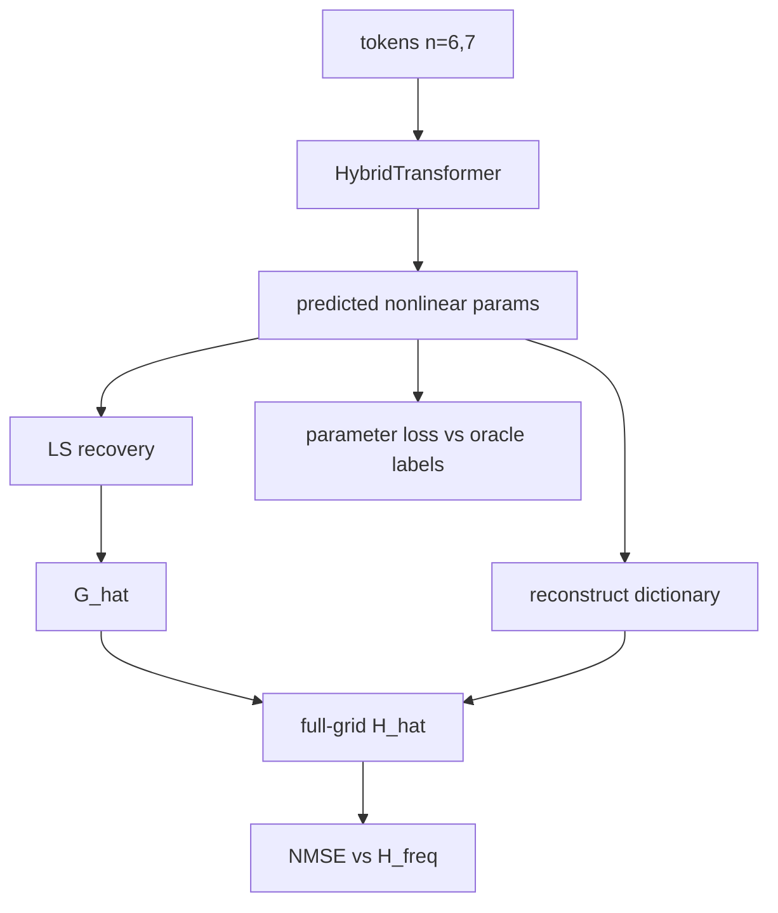
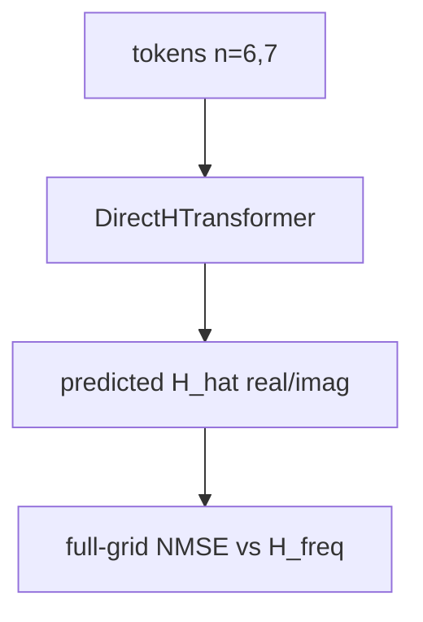

# 设计文档：Experiment Pipeline v1

## 当前状态

已有能力：

- `generate_thesis_dataset`: 生成 TDL-C `common_delay` 数据，并加入
  `total delay`、`CFO`、per-RX `rx_time_offsets_s`。
- `build_observation_tokens`: 只使用 `n=6,7` 构造 Transformer tokens。
- `recover_path_gains_ls`: 给定 nonlinear parameters 后，用 complex
  `LS recovery` 求 `G_hat`。
- `reconstruct_channel`: 重建 full-grid `H_hat`。
- `HybridTransformer`: 输出 nonlinear parameters。
- `DirectHTransformer`: 直接输出 full-grid `H_hat` 的 real/imag。
- E0 oracle LS sanity 已跑通。

缺口：

- `HybridTransformer` training loop 还需要把 predicted nonlinear parameters
  接到 `LS recovery` 和 `NMSE evaluation`。
- E1-E5 需要统一 runner 和统一 metrics schema。
- plots 需要覆盖 SNR、SER、`L_eff`、method comparison。

## 统一 Metrics Schema

所有实验输出统一保存为：

```json
{
  "experiment": "e1_clean_transformer",
  "method": "hybrid",
  "config": {},
  "history": [
    {
      "step": 0,
      "train_loss": 0.0,
      "param_loss": 0.0,
      "channel_nmse_db": 0.0,
      "observed_symbol_nmse_db": 0.0
    }
  ],
  "final": {
    "channel_nmse_db": 0.0,
    "observed_symbol_nmse_db": 0.0,
    "param_loss": 0.0
  }
}
```

对于 sweep 实验，外层为 list：

```json
[
  {
    "sweep_name": "l_eff",
    "sweep_value": 4,
    "method": "hybrid",
    "final": {}
  }
]
```

## Hybrid Evaluation Flow



训练阶段先使用 supervised parameter loss。每隔固定 steps 或每个 epoch
执行一次 LS-based evaluation。

这样避免在 v1 里把不可微的 NumPy `LS recovery` 直接塞进 training graph，
同时仍能验证最终 channel reconstruction。

## Direct-H Evaluation Flow



Direct-H baseline 不使用 physical parameters，也不做 `LS recovery`。

## 实验分层

### E1 Clean Transformer

目标：证明 `Transformer params + LS` 能在 clean setting 下重建
full-grid channel。

输出：

- training loss curve
- parameter loss curve
- `channel_nmse_db`
- hybrid vs direct-H comparison

### E2 Effective Path Ablation

目标：回答 `L_eff` 对压缩误差和重建性能的影响。

Sweep:

```text
L_eff = 2, 4, 6, 8, 12
```

输出：

- oracle LS `NMSE vs L_eff`
- hybrid `NMSE vs L_eff`
- optional direct-H reference line

### E3 AWGN Robustness

目标：评估 noise 对 hybrid 和 direct-H 的影响。

Sweep:

```text
SNR = 30, 20, 10, 5 dB
```

输出：

- `NMSE vs SNR`
- hybrid vs direct-H

### E4 Symbol Error Robustness

目标：评估 data-aided `x` 中 decision error 的误差传播。

Sweep:

```text
SER = 0, 0.01, 0.05, 0.10, 0.20
```

输出：

- `NMSE vs SER`
- hybrid vs direct-H
- pilot symbols 不被污染的 sanity check

### E5 Full Stress

目标：组合 sparse observation、AWGN、SER、compressed `L_eff`，形成最终复杂场景。

输出：

- final comparison table
- representative plots

## Presentation Figures

面向导师汇报，优先生成四张图：

1. Data generation + hybrid estimator flowchart。
2. `HybridTransformer` input/output diagram。
3. E0/E1 method comparison bar chart。
4. E2 `NMSE vs L_eff` curve。

